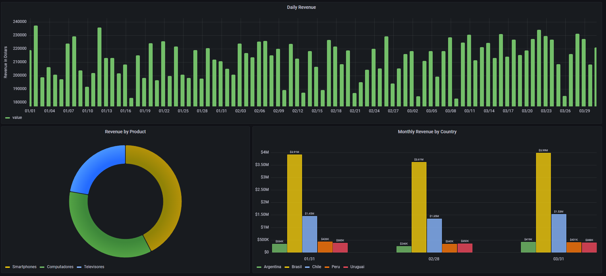

# prometheus-granafa-workshop
Sales database analysis using Grafana and application monitoring with Prometheus.

## Dashboard

The final dashboard answers the three following questions:
- How much was saled every day?
- Which is the most saled product?
- Which is the most representative market?

